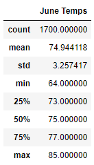

# Surf's Up!

## Overview of the Analysis
After doing an initial analysis of the temperatures and weather for a surf and ice cream shop on the island of Oahu, investors have requested further analysis in the temperature trends for June and December. We will use this analysis to detemine if the surf and ice cream shop will be successful.
### Resources
- Data source: hawaii.sqlite
- Software: Python 3.7.6, Jupyter Notebook

## Results
### June Analysis
- Temperatures in June look moderate. The lowest temperature for the month was 64 degrees, and even that is not too cold for ice cream!
- The mean temperature in June is about 75 degrees. This is perfect temperature for ice cream and surfing in Hawaii.
- Even the max temperature for June, 85 degrees, is not too high. Tourists will still want to travel to Oahu and enjoy surfing and ice cream.

### December Analysis
- December temperatures are a little lower than June's, but still manageable.
- The lowest temperature in December was 56, but that did not affect the average temperature much, which indicates very few days were that chilly.
- The average and max temperatures, 71 and 83 respectively, indicate that travelers will still be needing to cool off and enjoy some surfing and ice cream.

### Key Differences
- The lowest temperature in December and June are fairly far apart. A difference of 8 degrees can mean the difference between wanting to surf and staying in.
- The highest temperature between the two months are slightly off and could possibly mean a differing trend. Perhaps December had an usually hot day which accounted for the max temperature.
- The mean temperature for June temperatures is higher than December's. This could mean that sales in December could potentially dip lower than desired.

## Summary
In summary, this surf and ice cream shop looks to be very successful based on an analysis of average temperatures in June and December. However, some further analysis is always beneficial. I would suggest two queries. The first would look at the average rainfall compared to the temperatures. For instance, it might be 84 degrees outside but raining which would deter people from ice cream and surfing. A second addtional query would look at the statistics for the station that is closest to the potential surf and ice cream shop so investors can get a more accurate look at the weather in the area.
